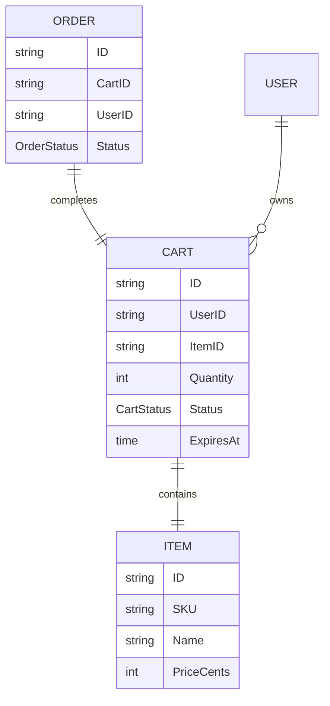
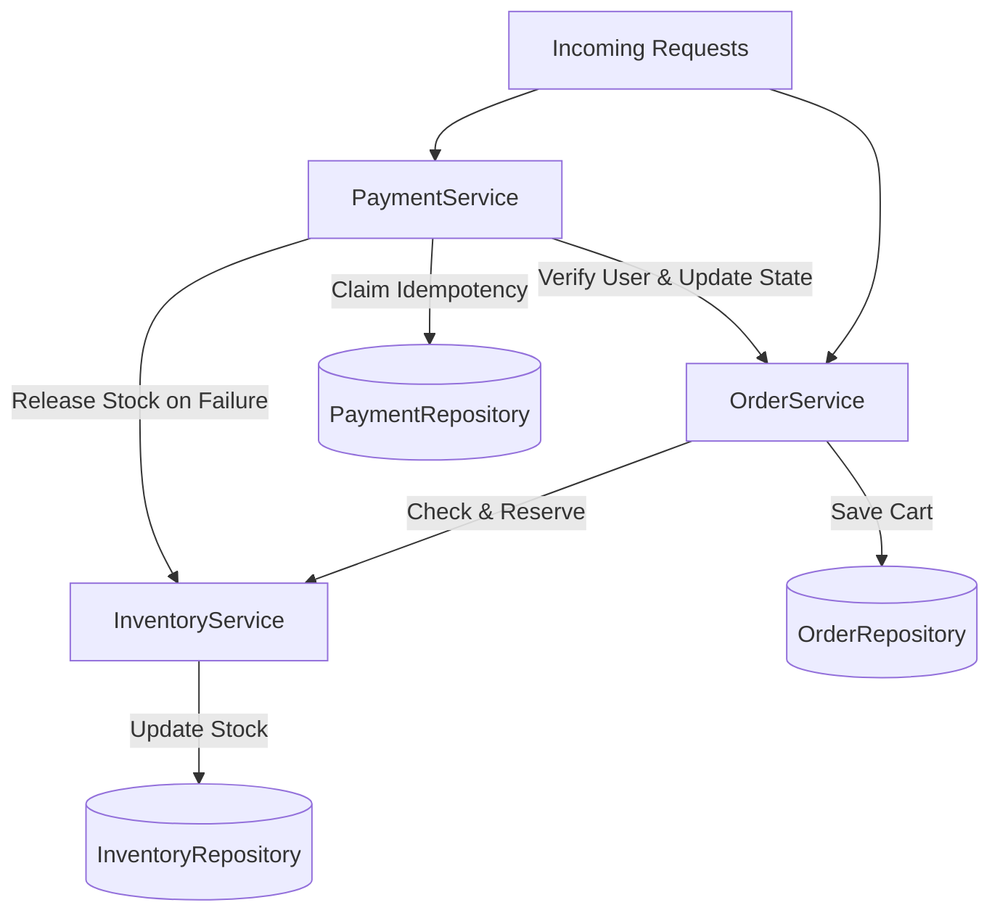

# Flash Sale Checkout System - Low Level Design (LLD)

This project is a minimal, production-oriented template for a high-concurrency flash sale checkout system, built in Go. It enables merchants to sell limited-edition inventory to a massive number of concurrent users without overselling.

It is designed with a strong focus on SOLID principles, modularity, concurrency safety, and robust state management.

## Core Features

- **Strict Inventory Control**: Uses atomic in-memory read-check-decrement operations to ensure stock is never oversold, even with 50,000 concurrent requests for 500 items.
- **Reservation TTL**: Shoppers receive a temporary reservation (e.g., 5 minutes) to complete payment. If payment fails or times out, stock is released.
- **Atomic State Transitions**: Cart statuses follow a strict state machine (`RESERVED` -> `PAYMENT_PROCESSING` -> `COMPLETED` / `PAYMENT_FAILED` or `EXPIRED`). State transitions are thread-safe and atomic.
- **Idempotency Ready**: Payments use an idempotency cache to prevent double-charging or double-order creation on retries.

## Requirements

### Functional Requirements
- **Inventory Management**: Track items and available stock for flash sale events.
- **Order / Cart Service**:
  - Ability to reserve an item and add it to a cart with a TTL (Time-To-Live).
  - **Cart Ownership**: Only the user who owns a reserved cart can initiate payment for it.
  - Active/passive background workers to expire reservations and release stock.
- **Payment Service**: Mock payment processing with idempotency to ensure double-charges or double-orders do not occur on retries. If payment fails, stock must be released.

### Non-Functional Requirements
- **Thread Safety / Concurrency**: Must handle 50k concurrent goroutines without race conditions.
- **High Availability & Scalability**: The design should be extensible to a highly available and horizontally scalable deployment; the current implementation uses in-memory repositories for demonstration.
- **Low Latency**: Fast response times for stock reservation (fail-fast if sold out).
- **Strong Consistency**: Absolute guarantee against overselling.

## Domain Entities & Relationships

The system's data is modeled around `Item` inventory, temporary `Cart` reservations, and final `Order`s.



## Component Dependencies

The system follows a clean architecture separating the **Services** (Business Logic) from the **Repositories** (Data Layer).



## Execution Flow (Atomic Checkout & Expiration)

The most critical aspect of the flash sale system is handling the race conditions between concurrent checkouts, payments, and background TTL expirations.

```mermaid
sequenceDiagram
    participant Client
    participant OrderSvc
    participant InventorySvc
    participant Repo
    participant PaymentSvc
    participant TTLWorker

    Client->>OrderSvc: AddToCart(UserID, ItemID)
    OrderSvc->>InventorySvc: Reserve(ItemID, 1)
    InventorySvc->>Repo: Lock & Decrement Stock
    Repo-->>OrderSvc: Stock Reserved
    OrderSvc->>Repo: Save Cart (Status=RESERVED, ExpiresAt=+5m)
    OrderSvc-->>Client: CartID

    rect rgb(30, 30, 30)
        Note over Client, PaymentSvc: Happy Path Payment
        Client->>PaymentSvc: MakePayment(CartID, IdempKey, UserID)
        PaymentSvc->>Repo: Claim IdempotencyKey (PROCESSING)
        PaymentSvc->>OrderSvc: UpdateCartStatus(RESERVED -> PAYMENT_PROCESSING)
        OrderSvc->>Repo: Atomic State Update
        PaymentSvc->>PaymentSvc: Mock Payment (Success)
        PaymentSvc->>OrderSvc: CompleteOrder()
        OrderSvc->>Repo: Save Order
        PaymentSvc->>Repo: Update IdempotencyKey (COMPLETED)
        PaymentSvc-->>Client: Order
    end
    
    rect rgb(50, 30, 30)
        Note over TTLWorker, Repo: Background Expiration (If Payment Fails or Times Out)
        loop Every 1s
            TTLWorker->>Repo: Find Expired Carts (Status=RESERVED)
            TTLWorker->>OrderSvc: ExpireCart(CartID)
            OrderSvc->>Repo: UpdateCartStatus(RESERVED -> EXPIRED)
            OrderSvc->>InventorySvc: Release(ItemID, 1)
            InventorySvc->>Repo: Lock & Increment Stock
        end
    end
```



## Folder Structure

```
├── cmd
│   └── main.go                  # Application entry point & simulation
├── internal
│   ├── models
│   │   └── models.go            # Core domain models (Item, Cart, Order)
│   ├── repositories
│   │   ├── inventory.go         # Inventory persistence & locking
│   │   ├── order.go             # Cart & Order persistence
│   │   └── payment.go           # Idempotency cache
│   └── services
│       ├── inventory.go         # Stock management
│       ├── inventory_test.go
│       ├── order.go             # Cart creation and TTL worker
│       ├── order_test.go
│       ├── payment.go           # Payment processing logic
│       └── payment_test.go
├── planning.txt
└── README.md
```

## Running the Simulation

A complete simulation is provided in `cmd/main.go`. It sets up a flash sale with 500 units of stock and simulates 50,000 concurrent users trying to add the item to their cart and pay immediately.

To run the simulation:

```bash
go run cmd/main.go
```

### Expected Output
You will see the system start the background worker, process the 50,000 concurrent requests, properly handle the reservations without overselling, and output the final stock.

```text
Starting Flash Sale Simulation...
Initial Stock: 500
---------------------------------------------------
Simulation Complete!
Total Concurrent Requests: 50000
Successful Cart Reservations: 500
Successful Orders: 500
Final Available Stock: 0
SUCCESS: System successfully prevented overselling!
```
